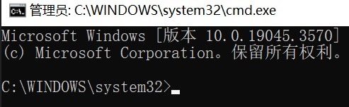

# 警告：该程序还未通过测试，请不要使用！

***

# MCSManager setup bat
一款为 MCSManager 做的 Windows 版在线安装脚本。  

[使用MIT许可证。](https://mit-license.org)  
仓库：  
> 境内Gitee:  https://gitee.com/bddjr/MCSManager-setup-bat  
> 境外Github:  https://github.com/bddjr/MCSManager-setup-bat

***
## 开始使用
如果您需要在云服务器安装，请使用远程桌面，而不是ssh。  

### 以管理员权限运行CMD  
复制下面这行命令，然后在服务器的远程桌面，按键盘 `win`+`R` 打开“运行” ，然后按键盘 `Ctrl`+`V` 的粘贴，然后按键盘的 `Enter` 。  
```
powershell start-process -verb runas cmd
```

如果弹出UAC点“是”，然后等待弹出 cmd 窗口，界面如下图。  



***
## 安装
接下来将以 `MCSManager-setup-cn-gitee.bat` 作为演示使用的脚本。  

### 1. 下载并运行安装脚本
复制下面这行命令，然后在服务器的远程桌面，对着管理员权限的 cmd 窗口右键粘贴，然后按键盘 `Enter` 运行。  
```cmd
cd /d "%temp%" && powershell Invoke-WebRequest -Uri "https://gitee.com/bddjr/MCSManager-setup-bat/raw/main/MCSManager-setup-en-gitee.bat" -OutFile MCSManager-setup-cn-gitee.bat && .\MCSManager-setup-cn-gitee.bat nopause
```
该脚本将会下载并解压 MCSManager 到 `C:\Program Files\MCSManager` ，然后自动安装服务。  

### 2. 立即启动 MCSManager
复制下面这行命令，然后在服务器的远程桌面，对着管理员权限的 cmd 窗口右键粘贴，然后按键盘 `Enter` 运行命令。  
```cmd
sc start MCSManager-daemon && sc start MCSManager-web
```

### 3. 删除安装脚本与缓存压缩包 (可选)
cmd 运行命令  
```cmd
del "%temp%\MCSManager-setup-cn-gitee.bat"
del "%temp%\MCSManager.zip"
```

***
## 卸载
接下来将以 `MCSManager-uninstaller-cn.bat` 作为演示使用的脚本。  

### 1. 下载并运行卸载脚本
复制下面这行命令，然后在服务器的远程桌面，对着管理员权限的 cmd 窗口右键粘贴，然后按键盘 `Enter` 运行。  
```cmd
cd /d "%temp%" && powershell curl -o MCSManager-uninstaller-cn.bat https://gitee.com/bddjr/MCSManager-setup-bat/raw/main/MCSManager-uninstaller-cn.bat && .\MCSManager-uninstaller-cn.bat nopause
```
该脚本将会停止服务、移除服务，然后删除文件夹 `C:\Program Files\MCSManager` 。  
### 2. 删除卸载脚本
cmd 运行命令  
```cmd
del "%temp%\MCSManager-uninstaller-cn.bat"
```

***
powershell ""([System.Text.Encoding]::UTF8.GetString((Invoke-WebRequest -Uri "https://gitee.com/bddjr/MCSManager-setup-bat/raw/main/MCSManager-setup-cn-gitee.bat" -UseBasicParsing).RawContentStream.ToArray())) ^| Out-File -Encoding utf8 -FilePath MCSManager-setup-cn-gitee.bat""
